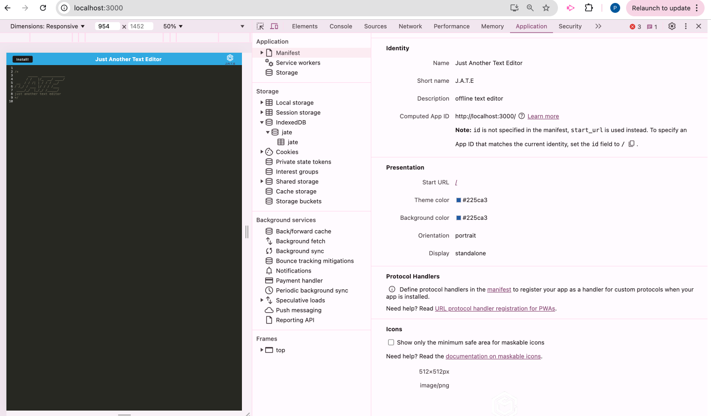
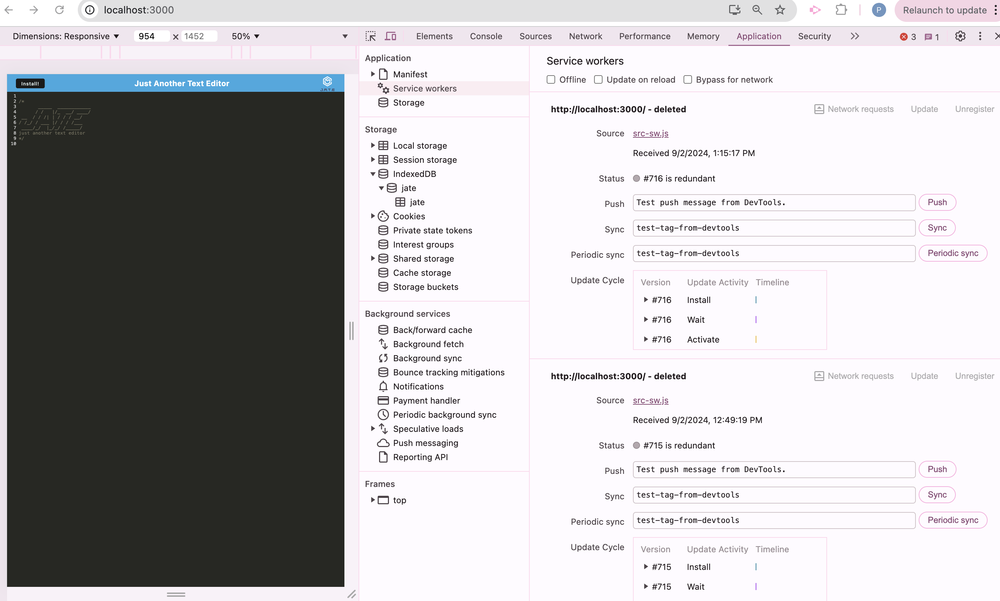
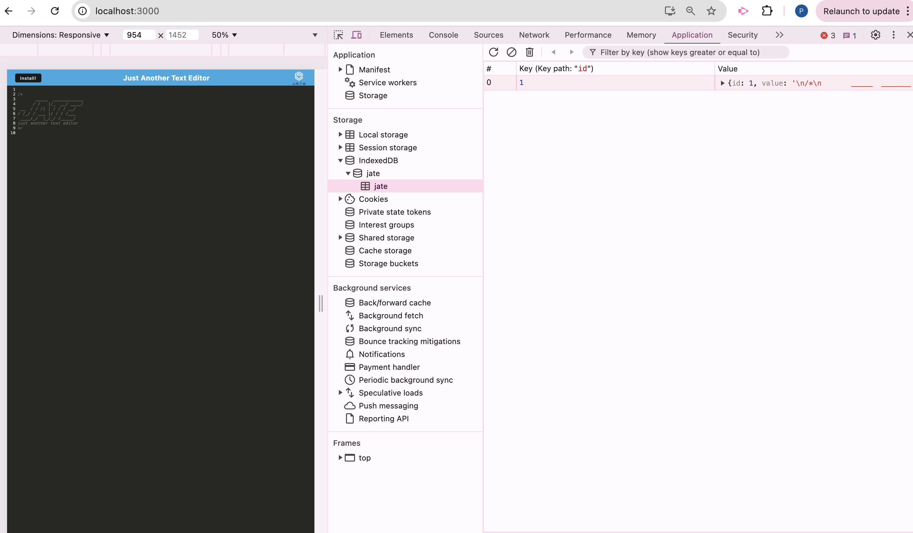
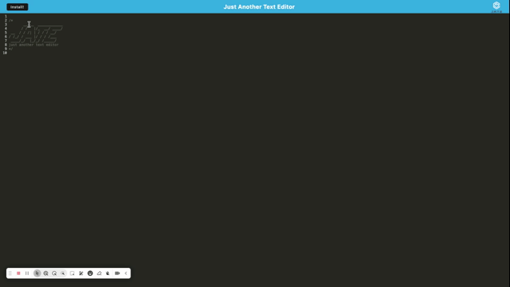

# Preksha-PWA-text-editor


# Description

The Preksha-PWA-text-editor is a Progressive Web Application (PWA) designed to provide a seamless and robust text editing experience. This application is built with modern web technologies, offering both online and offline capabilities. Whether you're jotting down notes or writing code, this editor ensures your work is always accessible and stored reliably.


## Table of Contents

* [Description](#description)

* [Usage Instructions](#usage-instructions)

* [Installation](#installation)

* [Features](#features)

* [Screenshots](#screenshot)

* [Demo](#Demo)

* [Questions](#questions)

# Usage Instructions 

* Launch the Application:

You can access the text editor via your web browser or install it as a standalone application on your desktop or mobile device.

* Creating and Editing:

Simply start typing in the text area. Your work is automatically saved in the browser's local storage, so you don't have to worry about losing your data.

* Offline Access:

Once installed, you can use the editor without an internet connection. Any changes made offline will sync once you regain connectivity.

* Installation:

For a native experience, install the PWA by clicking on the "Install" button in your browser's address bar.

# Installation 

To set up the Preksha-PWA-text-editor locally, follow these steps:

Clone the Repository:

``` ssh
git clone https://github.com/Preksha2408/Preksha-PWA-text-editor.git
cd Preksha-PWA-text-editor
Install Dependencies:

```

``` ssh

npm install
Run the Application:
``` ssh

npm run start
```

# Features

1. Progressive Web App: Installable on any device for offline access.
2. Automatic Saving: Content is saved in the browser's local storage, ensuring no data loss.
3. User-friendly Interface: Simple and intuitive design for seamless text editing.
4. Syntax Highlighting: Supports basic syntax highlighting for code snippets.
5. Responsive Design: Works perfectly across various devices and screen sizes.


# Screenshot

The Following image shows the applications manifest.json file 



The following image shows the application's registered service worker:



The following image shows the application's IndexedDB storage:




# Demo



# Questions 

For questions or further information, please contact me:

* Email - [prek.ps37@gmail.com](prek.ps37@gmail.com)

* GitHub - [Preksha2408](https://github.com/Preksha2408/Preksha-PWA-text-editor.git)

* Deployed app on render - [Deployed link](https://preksha-pwa-text-editor.onrender.com)